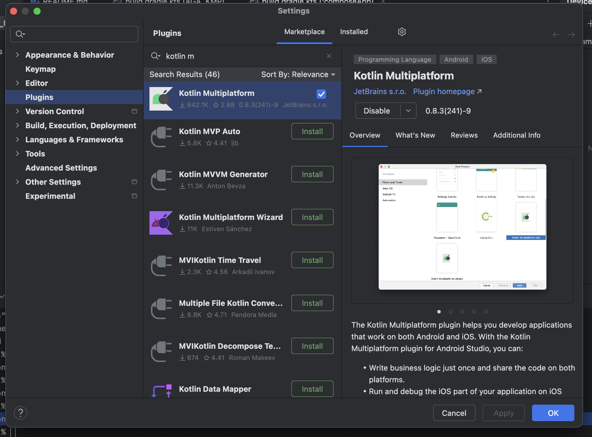
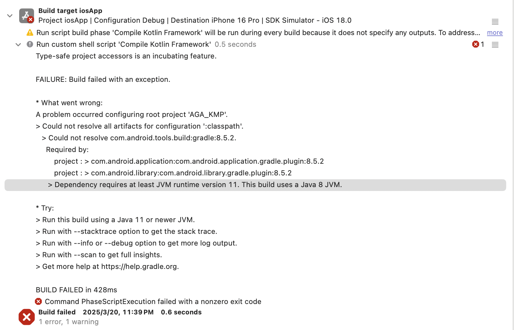
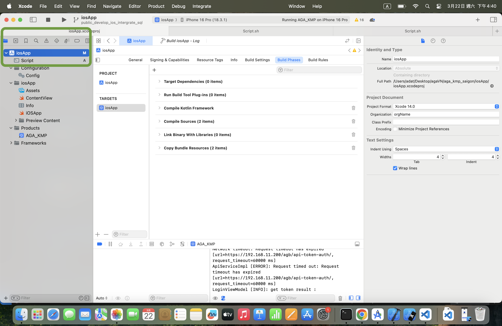
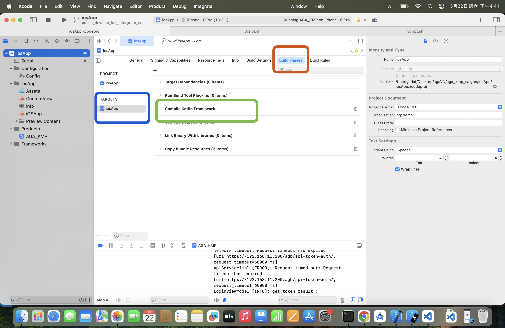
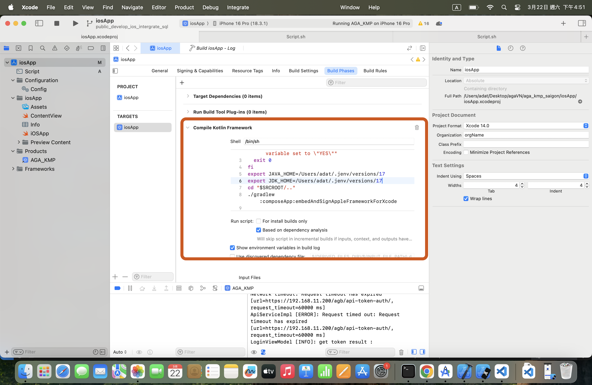

# Android Studio / Xcode KMM 環境建置指南

## 📌 安裝 Android Studio / Xcode 的 KMM 開發環境

### 1. 選擇相容版本的 IDE

Kotlin Multiplatform Mobile（KMM）對於 Android Studio 和 Xcode 的版本有一定的相容性要求。

請參考官方說明並安裝支援的版本組合：

🔗 [KMM 版本相容性官方文件](https://kotlinlang.org/docs/multiplatform-compatibility-guide.html#version-compatibility)

---

### 2. 安裝 Kotlin Multiplatform Plugin（在 Android Studio 中）

1. 開啟 Android Studio
2. 前往 `Settings / Preferences` → `Plugins`
3. 搜尋 `Kotlin Multiplatform` 並安裝

4. 重新啟動 Android Studio

---

## ⚙️ 設定 Android Studio / Xcode 使用 Java 17

### 1. 使用 Terminal 安裝與設定 Java 17

#### ✅ 安裝 Homebrew（如尚未安裝）
前往 [https://brew.sh/](https://brew.sh/) 依照指示安裝 Homebrew。

#### ✅ 使用 Homebrew 安裝 Java 17
```bash
brew install openjdk@17
```

#### ✅ 安裝 jenv 管理多版本 Java
```bash
brew install jenv
```

#### ✅ 將 jenv 加入環境變數（`~/.zshrc`）
```bash
echo 'export PATH="$HOME/.jenv/bin:$PATH"' >> ~/.zshrc
echo 'eval "$(jenv init -)"' >> ~/.zshrc
source ~/.zshrc
```

---

### 2. 加入 Java 17 到 jenv 控管

#### 🔍 檢查 Java 17 的安裝位置
```bash
brew --prefix openjdk@17
```
應輸出：
```
/opt/homebrew/opt/openjdk@17
```

#### ➕ 將 Java 17 加入 jenv
```bash
jenv add /opt/homebrew/opt/openjdk@17
```

#### ✅ 確認是否成功加入
```bash
jenv versions
```
你應會看到類似輸出：
```
system
  1.8
  11
* 17 (set by /Users/yourname/.jenv/version)
```

---

### 3. 設定 Java 版本

#### 🌐 設定全域使用 Java 17
```bash
jenv global 17
```

#### 📁 僅在當前專案使用 Java 17
```bash
cd /path/to/your/project
jenv local 17
```

#### 🔄 確保 JAVA_HOME 正確指向
若 `java -version` 仍顯示 Java 8，請執行：
```bash
jenv enable-plugin export
exec zsh
```

然後確認：
```bash
echo $JAVA_HOME
```
應該返回：
```
/Users/yourname/.jenv/versions/17.0.14
```

---

### 4. 驗證安裝是否成功
```bash
java -version
```
預期輸出：
```
openjdk version "17.0.14"
```

---
以下是你提供內容的 **Markdown（.md）格式** 中文版本，包含小標題與圖片佔位符，適合放入教學文件或 README 使用：

---

## 🛠 Xcode 安裝後的錯誤處理說明（設定 JAVA_HOME / JDK_HOME）

如果在部署 KMM 專案到 iOS 裝置時，遇到以下錯誤畫面：



則需要為 Xcode 特別設置 `JAVA_HOME` 與 `JDK_HOME`。請依照以下步驟操作：

---

### 🔹 步驟 1：選取 iOS 專案

在左側的專案視窗中，點擊 `iosApp`：



---

### 🔹 步驟 2：進入 Build Phases

1. 點選 `Targets` 底下的 `iosApp`
2. 點選上方分頁中的 **Build Phases**
3. 找到並展開 `Compile Kotlin Framework`



---

### 🔹 步驟 3：新增 JAVA_HOME / JDK_HOME 設定

在 **Run Script** 區塊中，向下滾動，找到以下這行：

```bash
cd "$SRCROOT/.."
```

在其**上方**加入以下兩行環境變數設定：

```bash
export JAVA_HOME=/Users/adat/.jenv/versions/17
export JDK_HOME=/Users/adat/.jenv/versions/17
```

> 📌 `/Users/adat/.jenv/versions/17` 是你在 Android Studio 中透過 jenv 所設置的 Java 路徑，請依照你的實際帳號調整路徑。



---

這樣就可以解決 Xcode 編譯 Kotlin Multiplatform Framework 時找不到 Java 環境的問題啦 ✅

📝 至此，你已成功完成 Android Studio / Xcode 的 KMM 開發環境建置！
